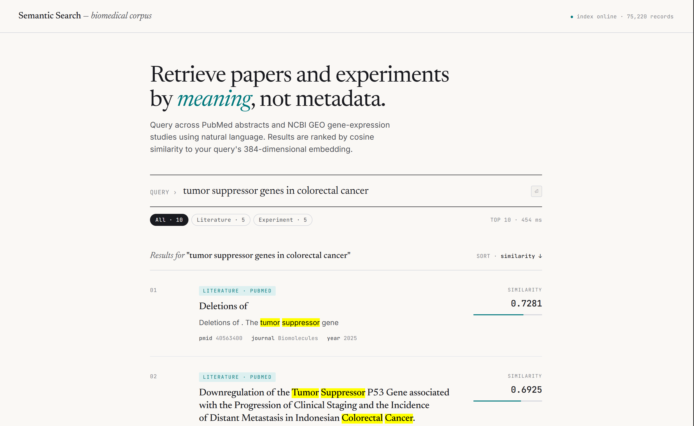
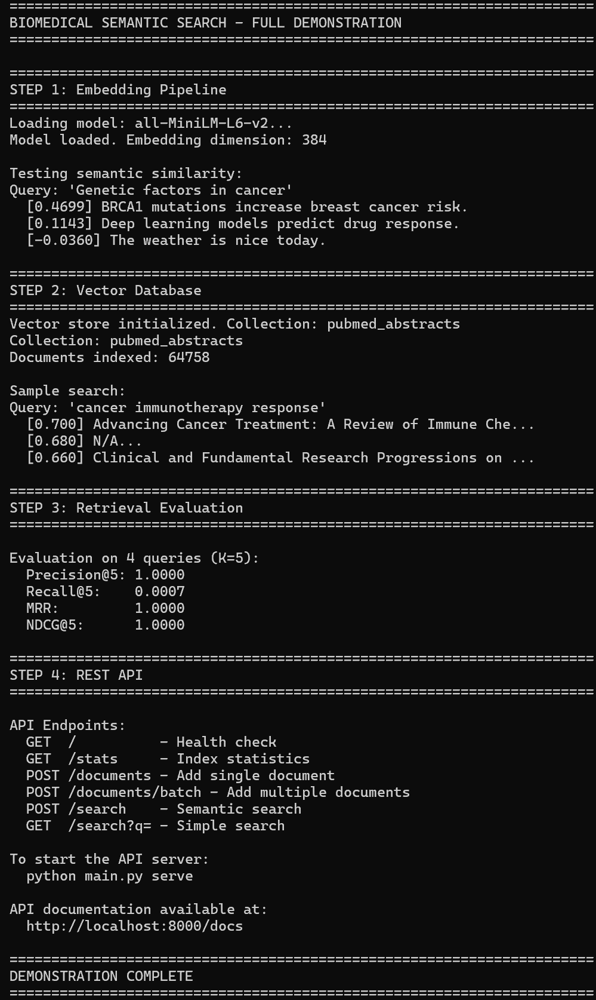

# Biomedical Semantic Search System

When I'm diving into a new research topic, I run the ingest scripts to pull down a focused corpus of PubMed abstracts — hundreds or thousands at once. Then instead of keyword-searching through them or bouncing between Google Scholar tabs, I just ask questions in plain language: *"what delivery mechanisms are used?"*, *"which studies report off-target effects?"*, *"how does this compare to chemotherapy?"*. The tool ranks abstracts by semantic similarity to my question, so I can scan the most relevant ones in minutes rather than hours.

That's the real use case. Google finds pages. This searches meaning across a corpus I already trust.

A personal tool I built to help me conduct literature reviews faster.

---

A **multimodal semantic search system** for biomedical data that enables retrieval based on **meaning rather than metadata**. Searches both literature and experimental datasets using natural language queries.

## Demo

### Web Search Interface (v2)

A clean search UI served directly by the API at `http://localhost:8000/`. Query PubMed literature and GEO experiments in one place, with similarity scores, keyword highlighting, and response time displayed per search.



*Searching "tumor suppressor genes in colorectal cancer" returns ranked results across 75,220 indexed records in ~454ms. Top result scores 0.7281 — a direct semantic match.*

### Semantic Search in Action

The system converts natural language queries into vector embeddings, then finds the most semantically similar documents from a corpus of 75,000+ biomedical records.



*The demo shows semantic similarity scoring in action. Notice how "BRCA1 mutations increase breast cancer risk" scores highest (0.47) for the query "Genetic factors in cancer", while an unrelated sentence about weather scores negative (-0.04).*


## Features

- **Multimodal Search**: Query both papers AND experimental datasets
- **Semantic Search**: Find data by meaning using neural embeddings
- **Vector Database**: Efficient similarity search with ChromaDB
- **REST API**: Production-ready FastAPI backend
- **PubMed Integration**: Real biomedical literature
- **GEO Integration**: Gene expression experiments from NCBI
- **Retrieval Evaluation**: Standard IR metrics (Precision, Recall, MRR, NDCG)

## Technologies

| Component | Technology |
|-----------|------------|
| Embeddings | Sentence-Transformers, Hugging Face |
| Vector DB | ChromaDB |
| ML Framework | PyTorch |
| API | FastAPI, Uvicorn |
| Literature Data | PubMed E-utilities API |
| Experimental Data | NCBI GEO API |

## Dataset Statistics

| Data Source | Documents Indexed |
|-------------|-------------------|
| PubMed Abstracts | 64,753 |
| GEO Experiments | 10,462 |
| **Total** | **75,215** |

## Project Structure

```
biomedical-semantic-search/
├── embeddings.py      # Hugging Face embedding pipeline
├── vector_store.py    # ChromaDB vector database
├── api.py             # FastAPI REST endpoints + web UI
├── static/
│   └── index.html     # Web search interface (served at /)
├── ingest_pubmed.py   # PubMed literature ingestion
├── ingest_geo.py      # GEO experimental data ingestion
├── evaluation.py      # Retrieval quality metrics
├── main.py            # Main entry point
├── test_api.py        # API tests
├── requirements.txt   # Python dependencies
└── chroma_data/       # Persisted vector database
    ├── pubmed_abstracts/   # Literature embeddings
    └── geo_experiments/    # Experiment embeddings
```

## Quick Start

### 1. Setup Environment

```bash
# Create virtual environment (use Python 3.12 x64)
python -m venv venv
venv\Scripts\activate  # Windows

# Install dependencies
pip install torch --index-url https://download.pytorch.org/whl/cpu
pip install transformers sentence-transformers chromadb fastapi uvicorn requests
```

### 2. Ingest Data

```bash
# Small-scale ingestion for testing
python ingest_pubmed.py
python ingest_geo.py

# Large-scale ingestion (builds full dataset)
python ingest_pubmed.py --large 100000
python ingest_geo.py --large 50000
```

The large-scale ingestion fetches from 48+ diverse biomedical queries to build a comprehensive corpus.

### 3. Run Demo

```bash
python main.py demo
```

### 4. Start API Server

```bash
python main.py serve
```

Web UI: http://localhost:8000/
API documentation: http://localhost:8000/docs

## API Endpoints

### Literature Search
| Method | Endpoint | Description |
|--------|----------|-------------|
| POST | `/search` | Semantic search on papers |
| GET | `/search?q=` | Simple paper search |
| GET | `/stats` | Paper index statistics |

### Experimental Data Search
| Method | Endpoint | Description |
|--------|----------|-------------|
| POST | `/search/experiments` | Search GEO experiments |
| GET | `/search/experiments?q=` | Simple experiment search |
| GET | `/stats/experiments` | Experiment index statistics |

### Document Management
| Method | Endpoint | Description |
|--------|----------|-------------|
| POST | `/documents` | Add single document |
| POST | `/documents/batch` | Add multiple documents |
| GET | `/` | Web search UI |
| GET | `/health` | Health check |

### Example Search Request

```bash
curl -X POST "http://localhost:8000/search" \
  -H "Content-Type: application/json" \
  -d '{"query": "What genes are linked to breast cancer?", "n_results": 5}'
```

## How It Works

### 1. Embedding Pipeline (`embeddings.py`)
Text is converted to 384-dimensional vectors using Sentence-Transformers. The model (`all-MiniLM-L6-v2`) captures semantic meaning, so "cancer treatment" and "tumor therapy" are recognized as similar even without shared keywords.

### 2. Vector Database (`vector_store.py`)
Embeddings are stored in ChromaDB with HNSW indexing for fast approximate nearest neighbor search. This enables sub-second queries across 75,000+ documents.

### 3. Semantic Search (`api.py`)
When you search, your query is embedded and compared against all stored vectors. Results are ranked by cosine similarity—documents with similar meaning rank highest.

### 4. Retrieval Evaluation (`evaluation.py`)
Search quality is measured using standard IR metrics:
- **Precision@K**: Fraction of top-K results that are relevant
- **Recall@K**: Fraction of relevant documents retrieved
- **MRR**: Mean Reciprocal Rank
- **NDCG@K**: Normalized Discounted Cumulative Gain

## Evaluation Results

Evaluated using synthetic relevance judgments (keyword-based pseudo-labels):

| Metric | K=5 | Description |
|--------|-----|-------------|
| Precision@K | 1.00 | All top-5 results contain target keywords |
| Recall@K | 0.0007 | 5 retrieved out of ~7,000 matching docs |
| MRR | 1.00 | First result is always relevant |
| NDCG@K | 1.00 | Perfect ranking within top-5 |

*Note: High precision is expected with keyword-based relevance on a large corpus. For production use, human relevance judgments would provide more meaningful evaluation.*

## Author

Felix Borrego
MS Biostatistics, UMass Amherst
[GitHub](https://github.com/Febo2788)

## License

MIT License - Free for educational and research use.
